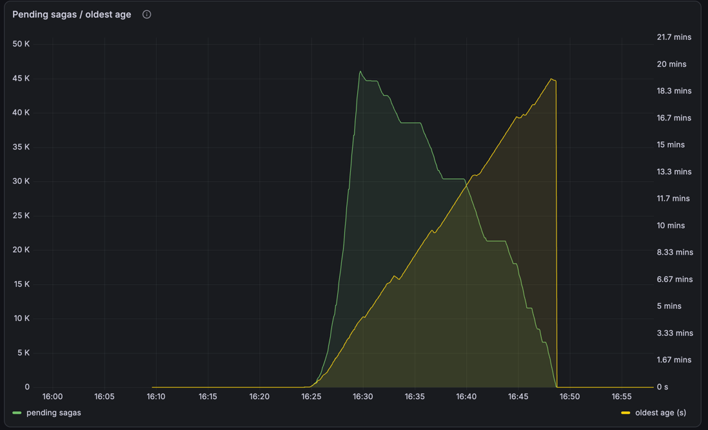
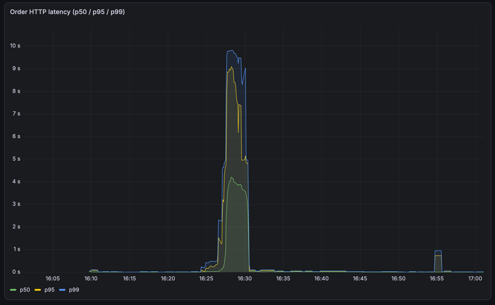
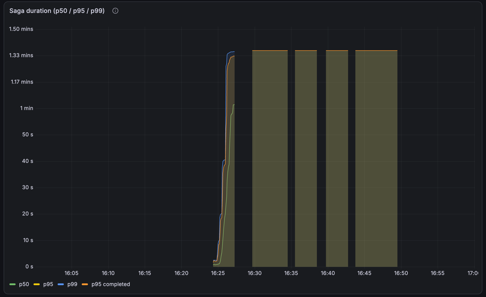
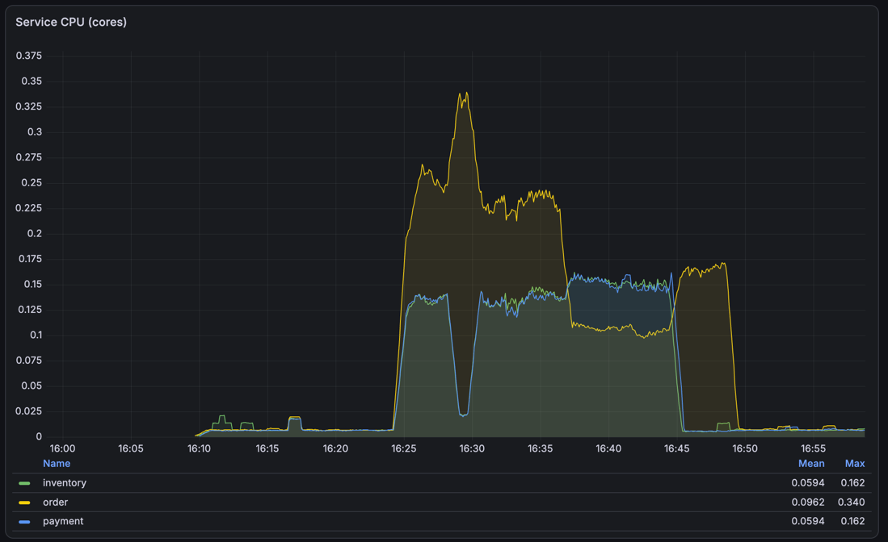
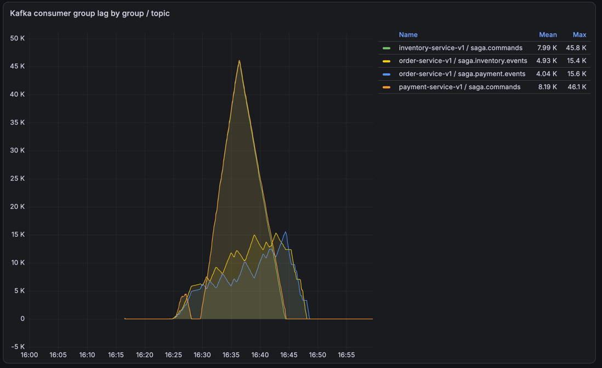
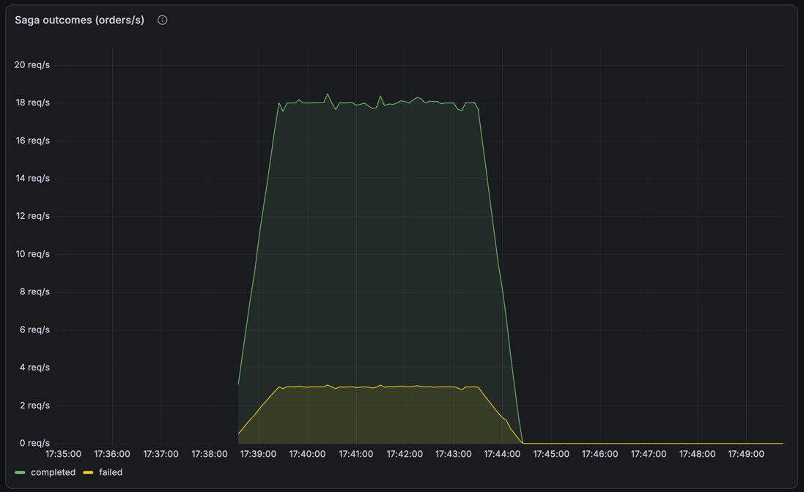
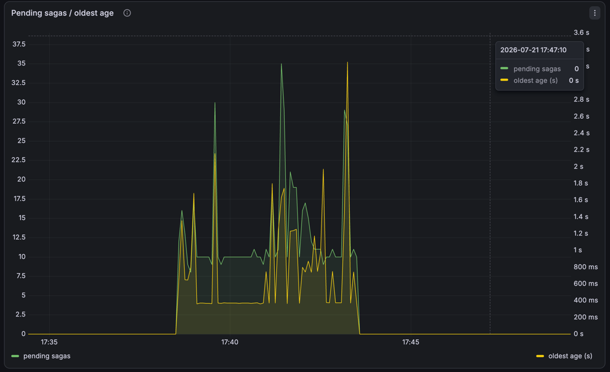
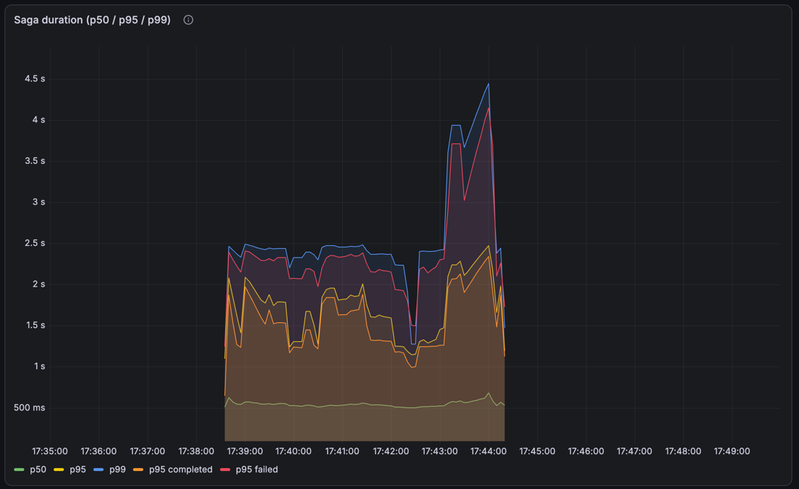
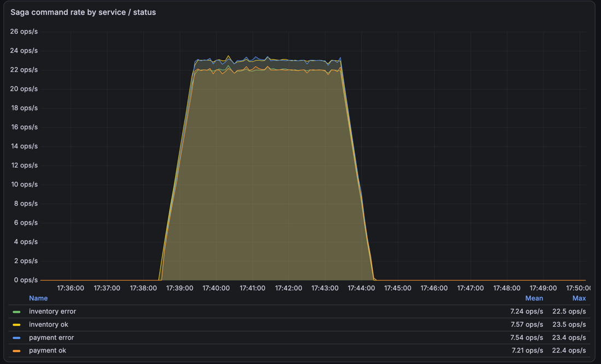
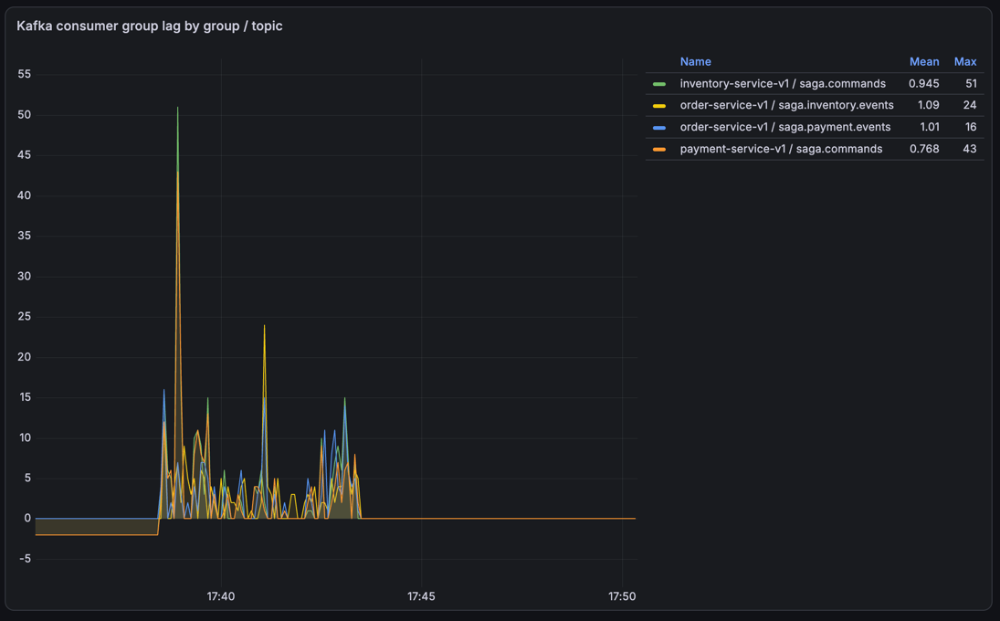

# Результаты нагрузочного тестирования

Два прогона от **2026-07-21** на одном стенде:

1. **[Capacity](#прогон-1-capacity--поиск-потолка)** (`orders-capacity.js`) — поиск потолка.
   Порогов намеренно нет: цель найти, где всё сломается.
2. **[Mixed](#прогон-2-mixed--рабочая-нагрузка)** (`orders-mixed.js`) — смешанный
   бизнес-профиль на рабочей скорости, найденной первым прогоном.

Порядок не случаен: пока потолок не найден, любые выводы вида «сага держит N rps»
на самом деле рассказывают про размер VPS. Между прогонами исправлены две вещи,
без которых второй был бы бессмысленным, — см. проблемы 1 и 3.

---

## Стенд

| Параметр | Значение |
|---|---|
| VPS | 2 vCPU Intel Xeon Platinum 8260 @ 2.40GHz, 10 GiB RAM |
| Docker | 29.6.2 |
| Что крутится | 3 Go-сервиса, 3 Postgres, Kafka (KRaft), Prometheus, Grafana, cAdvisor, kafka-exporter, kafka-ui |
| Генератор | k6 v1.7.0 с локальной машины, снаружи |
| Каталог | 200 SKU × 200 000 шт., 200 счетов × 20 000 000 |

**Два ядра на всё** — это главный контекст для любых цифр ниже. Генератор вынесен
за пределы VPS намеренно: запусти k6 там же, и он бы конкурировал за те же два ядра
с измеряемой системой.

Перед прогоном базы вычищены, `verify-consistency.sh` на чистом состоянии дал
все OK — это эталон, относительно которого сравнивались результаты после нагрузки.

> **О времени.** На скриншотах Grafana время местное (MSK), в выводах команд и
> логах — UTC. Разница ровно 3 часа: прогон 13:28–13:33 UTC = 16:28–16:33 на
> графиках.

---

# Прогон 1: capacity — поиск потолка

## Профиль нагрузки

Ступени по минуте: 50 → 100 → 200 → 400 → 800 rps, затем спад 30 с.
Параллельно baseline-поток 2 rps на `GET /healthz` — он показывает, что чувствует
обычный пользователь, пока систему давят.

---

## Результат: потолок ~200 rps

```
WARN[0177] Insufficient VUs, reached 1000 active VUs and cannot initialize more
```

177-я секунда — конец ступени «до 200 rps». Дальше числа описывают уже генератор,
а не сервер. Ступени 400 и 800 фактически не состоялись.

| Метрика | Значение |
|---|---|
| Принято заказов | 49 670 |
| Фактический throughput | **152 rps** |
| `dropped_iterations` | 32 085 (97/с) |
| `http_req_duration` med | 3.35 с |
| `http_req_duration` p95 | 5.34 с |
| Ошибок | 9 из 50 326 (0.01%) |

Все 9 ошибок — таймауты по 15 с, ни одного `5xx`. Система под перегрузом
**замедлялась, но не отказывала**. Это разные вещи, и различие здесь принципиальное.

Baseline при этом: медиана 95.91 мс (сетевой RTT до VPS — 90 мс, то есть накладных
почти нет), но p95 449 мс и max 12.21 с. Хвост уехал, медиана — нет.

---

## Главный вывод: два разных потолка

| Потолок | Значение |
|---|---|
| Приём HTTP (`POST /orders`) | ~152 rps |
| Сага целиком | **~32/с** |

`POST /orders` отвечает `201` сразу после записи в outbox — до того, как сага
вообще началась. Приёмный тракт в **4.7 раза** быстрее саги, поэтому под нагрузкой
очередь растёт линейно, а клиент об этом не знает: ему уже подтвердили заказ.

Цифры за прогон:

```
принято заказов:            49 670
пик pending (по графику):   ~46 000
completed к первому замеру: 11 135
pending к первому замеру:   38 535
```

Пик в 46 тысяч пришёлся на конец нагрузки: почти всё принятое ещё не обработано.
38 535 — это уже замер минутой позже, когда слив начался.

Именно ради этого разрыва и вводилась `order_saga_duration_seconds`. HTTP-метрика
показала бы «p95 5.34 с» — и это было бы враньём про реальное время жизни заказа.

Рабочая скорость для последующих прогонов считается **от саговского потолка**:
60–70% от 32/с ≈ **20 rps**. Отсчёт от 152 дал бы ~90 rps и снова копил очередь.



Весь сюжет на одной картинке. Зелёная линия — незавершённые саги: вертикальный
взлёт до **46 тысяч** за пять минут нагрузки, затем пятнадцатиминутный спад до нуля.
Жёлтая — возраст самой старой незавершённой саги, доросший до **18.3 минуты**.
Обрыв обеих в ноль на 16:49 — момент, когда система полностью разобрала завал.

Ступенька на зелёной около 16:39–16:41 — та самая необъяснённая пауза
(проблема 4 ниже).

### HTTP говорит секунды, сага говорит минуты





Две панели об одной и той же нагрузке. HTTP-латентность измеряется секундами,
сага — минутами. Клиент получил `201` и ушёл довольный; заказ в этот момент ещё
не начинал обрабатываться.

Вторая панель заодно показывает сломанную метрику: p50, p95 и p99 слиплись в одну
прямую на 1.37 минуты — это `81.92 с`, граница последнего бакета гистограммы.
Подробности в проблеме 1.

---

## Где узкое место: не там, где ожидалось



Панель `Service CPU (cores)` показывает только три Go-сервиса, и они **не упирались
в CPU**:

| Сервис | Mean | Max |
|---|---|---|
| order | 0.096 | 0.340 |
| inventory | 0.059 | 0.162 |
| payment | 0.059 | 0.162 |

Втроём — максимум 0.66 ядра из двух. Первоначальная гипотеза «упёрлись в железо»
на этом рассыпается, и пришлось смотреть шире. Пик по **всем** контейнерам:

| Контейнер | Пик, ядер |
|---|---|
| **kafka** | **0.697** |
| postgres-order | 0.333 |
| order | 0.328 |
| inventory | 0.159 |
| payment | 0.158 |
| postgres-payment | 0.137 |
| cadvisor | 0.136 |
| postgres-inventory | 0.136 |
| grafana | 0.047 |
| prometheus | 0.030 |

Одновременный пик по всем контейнерам — **1.612 ядра из 2 (81%)**.

Три вывода, ни один из которых не был очевиден заранее:

1. **Самый прожорливый компонент — Kafka**, 0.697 ядра. Вдвое больше любого
   Go-сервиса и больше, чем все три вместе. Сага дешёвая, транспорт дорогой.
2. **Мониторинг стоит ~0.23 ядра — 12% машины.** Один `cadvisor` ест почти столько
   же, сколько `inventory`. Наблюдаемость на маленьком стенде не бесплатна, и это
   надо учитывать, интерпретируя потолок.
3. **81% — это не 100%.** Потолок объясняется не только процессором. Честный ответ:
   причина не установлена. `node_cpu_seconds_total` пуст — node-exporter не стоит,
   поэтому iowait и steal time не видны, а на виртуалке steal бывает
   значительным. Установка node-exporter заведена в [todo.md](todo.md).

Косвенный аргумент против «упёрлись в CPU»: `order` держал медиану ответа 3.35 с,
потребляя 0.33 ядра. Так выглядит не нехватка процессора, а ожидание —
на пуле соединений к Postgres или на блокировках. Это следующая гипотеза для проверки.

---

## Восстановление

Нагрузка снята — система разгребала завал сама, без вмешательства.

| Этап | Длительность |
|---|---|
| Outbox `order` (25 238 → 0) | ~1.5 мин, ~310 msg/с |
| Полный слив pending (49 670 → 0) | **~15 минут** |

Скорость слива менялась: ~32/с пока inventory и payment догоняли свои лаги, затем
~58/с, когда они освободились и перестали конкурировать за CPU.

Финальная сверка после слива:

```
== Саги в полёте ==
      заказов в pending: 0
OK    нет саг, зависших дольше 60с                 0
== Согласованность order.status и saga_state ==
OK    completed только при reserved+charged        0
OK    нет failed с незавершённым возвратом         0
OK    нет failed с неснятым резервом               0
OK    нет заказов без saga_state                   0
== Кросс-базовый инвариант: склад ==
OK    удержанный сток сходится с order         49670
OK    нет отрицательного/переполненного стока      0
== Outbox ==
OK    outbox разгребён                             0
OK    нет сообщений с attempts>5                   0

ИТОГ: все инварианты держатся
```

**49 670 заказов, ноль `failed`, ноль расхождений между тремя базами** — при том, что
30 тысяч саг доигрывались уже в перегруженной системе. Это и есть главный
содержательный результат: не «выдержало N rps», а «под перегрузом не разъехалось».



| Группа / топик | Пик лага |
|---|---|
| payment-service-v1 / saga.commands | 46.1 K |
| inventory-service-v1 / saga.commands | 45.8 K |
| order-service-v1 / saga.payment.events | 15.6 K |
| order-service-v1 / saga.inventory.events | 15.4 K |

Обрати внимание на первые две строки: `payment` и `inventory` набрали **почти
одинаковый лаг ~46 K**, притом что команд каждого типа было по ~49 700. Это прямое
следствие общего топика `saga.commands` — оба сервиса вычитывают весь поток целиком,
включая чужие команды. См. проблему 2.

---

# Прогон 2: mixed — рабочая нагрузка

`RATE=20` — 60–70% от саговского потолка (~32/с), найденного первым прогоном.
Длительность 5 минут. Четыре бизнес-потока идут одновременно, потому что в проде
они и идут одновременно:

| Поток | rps | Ожидаемый исход |
|---|---|---|
| happy | 16 | `completed` |
| insufficient_funds | 2 | `failed` + `release_inventory` |
| out_of_stock | 1 | `failed` + `refund_payment` |
| duplicates | 1 итерация → **2 заказа** | `completed` ×2 |
| baseline | 2 | `GET /healthz` |

Перед прогоном базы вычищены полностью, `vps-verify` на чистом состоянии дал все OK.

## Главное: это первый прогон, проверивший компенсации

В capacity было **ноль** `failed` — а значит три проверки в `verify-consistency.sh`
(«нет failed с незавершённым возвратом», «нет failed с неснятым резервом»,
«completed только при reserved+charged») проходили вхолостую: им нечего было
проверять. Здесь 901 упавшая сага, и обе ветки компенсации отработали.

```
== Кросс-базовый инвариант: склад ==
OK    удержанный сток сходится с order          5402
OK    нет failed с незавершённым возвратом         0
OK    нет failed с неснятым резервом               0

ИТОГ: все инварианты держатся
```

Удержанный сток `5402` в точности равен числу `completed`: каждый успешный заказ
держит свою единицу, все 901 упавших вернули товар. Через восемь минут после
прогона цифра не сдвинулась — запоздалых откатов и повторных списаний нет.

## Итоги

| Метрика | Значение |
|---|---|
| Всего заказов | 6303 |
| `completed` / `failed` | 5402 / 901 (6:1) |
| Пик pending | **35** |
| Возраст старейшей саги | 3.6 с |
| Recovery после снятия нагрузки | **< 32 с** |



Ровные полки 18 и 3 заказа в секунду — ровно то, что заказано профилем.
Ни дрейфа, ни деградации на протяжении всех пяти минут.



Сравни с той же панелью на capacity: там 46 000 зависших саг и пятнадцать минут
разбора завала, здесь колебания в диапазоне 0–35 и возраст старейшей саги 3.6 с.
Система идёт вровень с нагрузкой.

Отсюда важный вывод: **время восстановления — не свойство системы, а функция
перегруза.** 15 минут против 32 секунд, разница только в rps.

## Цена компенсации — измерена



Гистограмма ожила: вместо полки на 81.92 с (проблема 1) — живое распределение.

| Квантиль | Значение |
|---|---|
| p50 | 0.538 с |
| p95 | 1.79 с |
| p99 | 2.48 с |
| **p95 `completed`** | **1.572 с** |
| **p95 `failed`** | **2.340 с** |

Красная линия (`p95 failed`) устойчиво идёт выше оранжевой (`p95 completed`) на
всём протяжении прогона. **Откат на 49% дороже успеха** — компенсация это лишний
раунд по Kafka, и теперь известно, во что он обходится. Гипотеза была высказана
до прогона и подтвердилась.

Всплеск p99 до 4.4 с на 17:43 — хвост прогона, когда k6 добивал остаток
итераций перед graceful stop.

## Разрыв HTTP и саги держится и на здоровой нагрузке

| | p50 | p95 |
|---|---|---|
| HTTP `POST /orders` | **16 мс** | 340 мс |
| Сага целиком | **538 мс** | 1.79 с |

**Разница в 33 раза по медиане** — при нагрузке, которую система держит без всякой
очереди. Тезис работает не только на перегрузе: клиент видит 16 миллисекунд,
распределённая транзакция живёт полсекунды.

## Половина работы консьюмеров — впустую



| Серия | Mean | Max |
|---|---|---|
| inventory error | 7.24 ops/s | 22.5 |
| inventory ok | 7.57 ops/s | 23.5 |
| payment error | 7.54 ops/s | 23.4 |
| payment ok | 7.21 ops/s | 22.4 |

Ошибок ровно столько же, сколько успехов — у обоих сервисов. Это прямое измерение
проблемы 2: из общего топика `saga.commands` каждый сервис вычитывает и
десериализует чужие команды, чтобы их отбросить. **Половина обработки — накладные
расходы схемы.**



Лаг при этом держится у нуля: на 20 rps даже двойная работа консьюмеров не
создаёт отставания. Проблема не в том, что схема не работает, а в том, что она
съедает запас, который понадобится ближе к потолку.

## Метрики хоста — node-exporter в деле

Первый прогон с метриками уровня хоста. Среднее за время нагрузки:

| Режим | Ядер (из 2) |
|---|---|
| Всего занято | 1.081 (54%) |
| user | 0.591 |
| system | 0.241 |
| iowait | 0.181 (9%) |
| **steal** | **0.025 (1.2%)** |

**Steal исключён** как объяснение потолка: сосед по гипервизору не мешает. Одна из
трёх гипотез первого прогона закрыта измерением.

`iowait` 9% заметен, но на этой нагрузке не доминирует. Настоящая проверка — на
перепрогоне capacity: если под 150 rps iowait уедет в разы, значит потолок дисковый,
и это объяснит, почему при свободном CPU медиана ответа была 3.35 с.

54% при 20 rps означает, что запаса немного, но масштабирование нелинейно: линейная
экстраполяция дала бы потолок ~37 rps, а реально система приняла 152. Большая часть
нагрузки на холостом ходу — постоянные накладные: Kafka, мониторинг, healthcheck'и.

## Пороги k6

В отличие от capacity у `orders-mixed.js` есть пороги, и прогон обязан их пройти:

```
http_req_duration{endpoint:orders}  p95<1500ms  p99<3000ms
http_req_failed{endpoint:orders}    rate<3%
baseline_healthz_duration           p95<1000ms
order_accepted                      rate>97%
```

## Что этот прогон НЕ проверил

Поток `duplicateSubmit` шлёт два одинаковых запроса подряд и создаёт **два заказа
с двойным списанием** — ключа идемпотентности у `POST /orders` нет (пункт 4
в [todo.md](todo.md)). `verify-consistency.sh` нарушением это не считает: оба заказа
честно завершены, инварианты формально соблюдены. Дыра видна только в бизнес-логике.

Поэтому 6303 заказа против ожидаемых 6000 — не погрешность, а ровно те дубли.

---

## Проблемы, найденные прогонами

Прогон ценен не цифрами, а тем, что вскрыл. Все четыре пункта заведены в
[todo.md](todo.md).

### 1. Гистограмма саги переполнилась — ИСПРАВЛЕНО

p50, p95 и p99 вернули **ровно 81.92 с** — все три. Это верхняя граница последнего
бакета: `ExponentialBuckets(0.005, 2, 15)` даёт `0.005 × 2^14 = 81.92`
(`order/internal/observability/metrics.go:85`). Когда квантиль попадает в `+Inf`,
`histogram_quantile` возвращает границу последнего бакета — то есть больше половины
саг шли дольше 82 с, и гистограмма их уже не различает.

Самая старая незавершённая сага дожила до **1121 с** (18.7 минуты) при потолке
метрики в 82 с.

Метрику вводили, чтобы показать разрыв между HTTP и сагой, — и на первом же
серьёзном прогоне она упёрлась в потолок и выдала константу.

Исправлено перед прогоном mixed: `ExponentialBuckets(0.005, 2, 20)` → потолок
~2621 с (44 мин), с запасом на chaos-сценарии. Проверено на mixed — полки нет,
квантили осмысленные, видна разница между `completed` и `failed`.

### 2. Общий топик `saga.commands` — двойная работа консьюмеров

Каждый сервис вычитывает и десериализует 100% команд, чтобы выбросить половину:

```
inventory: msg="command received" type=charge_payment sku="" qty=0
inventory: level=ERROR msg="command processing failed" err="invalid command"
payment:   msg="command received" type=reserve_inventory account_id="" amount=0
payment:   level=ERROR msg="command processing failed" err="invalid command"
```

В todo это было записано как косметика («половина `command_total{status=error}` —
ложная»). Прогон показал, что это оверхед на самом узком месте системы. Плюс
настоящую ошибку в таком шуме не заметить.

### 3. Healthcheck Kafka искажает измерения — ИСПРАВЛЕНО

`kafka-topics.sh --list` с `timeout: 5s`, `interval: 10s`. Скрипт поднимает JVM на
каждый вызов, под нагрузкой не укладывается в 5 с — контейнер ушёл в `unhealthy`
(`FailingStreak: 33`). Брокер при этом исправен, оффсеты растут.

Две беды: ложный `unhealthy` и **запуск JVM каждые 10 секунд на той самой машине,
потолок которой измеряется**. За 5.5 минуты прогона — 33 запуска JVM на двух ядрах.

Исправлено перед прогоном mixed: `interval` 30 с, `timeout` 20 с, оба вынесены
в переменные окружения (`KAFKA_HEALTHCHECK_INTERVAL`, `KAFKA_HEALTHCHECK_TIMEOUT`).

### 4. Необъяснённая пауза 96 секунд

Слив встал намертво с 13:41:59 по 13:43:35 при непустом лаге и живых консьюмерах,
затем возобновился и пошёл быстрее прежнего:

```
13:41:59  pending=21303
13:42:31  pending=21303
13:43:03  pending=21303
13:43:35  pending=21303
13:44:06  pending=19327   ← возобновилось
```

Причина не установлена. Кандидаты: ребаланс консьюмер-группы, чекпоинт Postgres,
голодание по CPU. Оставлено открытым — если повторится, копать логи Kafka на предмет
rebalance.

---

## Что дальше

Сделано:

- ~~Починить бакеты гистограммы~~ — проблема 1, проверено на mixed.
- ~~Поставить node-exporter~~ — steal исключён, iowait под подозрением.
- ~~Починить healthcheck Kafka~~ — проблема 3.
- ~~`RATE=20`, `make load-mixed`~~ — этот отчёт.

Осталось:

1. **`make load-hotkey`** на том же `RATE=20` — весь трафик в один SKU. Разница
   с mixed и есть цена row-level lock на строке склада. Единственный прогон,
   которого не хватает для полной картины на рабочей скорости.
2. **Перепрогнать capacity мелкими ступенями**: `START_RATE=25 STEP_1=50 STEP_2=75
   STEP_3=100 STEP_4=150 STEP_5=200`. Первый прогон потратил три минуты из пяти на
   ступени, куда генератор не доехал, — точка излома известна лишь как «между 200
   и 400». Теперь есть node-exporter, так что заодно проверится гипотеза про iowait.
3. **Разделить топик `saga.commands`** (проблема 2) — и перепрогнать mixed для
   сравнения «до/после». Делать строго после пункта 1, иначе не с чем сравнивать.
4. **Ключ идемпотентности** для `POST /orders` — тогда поток `duplicateSubmit`
   из демонстрации проблемы превратится в регрессионный тест.
5. **Resilience-демо**: `make vps-chaos` под нагрузкой 20 rps. Гистограмма теперь
   держит до 44 минут, так что recovery time будет видно на графике целиком.

---

## Методические заметки

Пригодится тому, кто будет повторять.

- **Чистить БД перед каждым прогоном.** `verify-consistency.sh` считает по всей
  таблице без временного окна: старые `pending` роняют проверку навсегда, а
  `oldest_pending_age_seconds` показывает возраст мусора и делает измерение recovery
  бессмысленным. У Kafka и Prometheus именованных вольюмов нет — они чистятся сами
  на `make down`, а вот три `postgres_*_data` переживают перезапуск.
- **Прогонять `vps-verify` до нагрузки**, не только после: нужен эталон.
- **`MAX_VUS` в `.env.loadtest` перетирает дефолт скрипта** — Makefile сорсит файл
  через `set -a`. С `MAX_VUS=300` упрёшься в генератор раньше, чем в сервер, и
  измеришь собственный k6. Поднято до 1000.
- **Потолок читается не по цифре rps из отчёта**, а по предупреждению k6 про
  `Insufficient VUs` — с этого момента числа описывают генератор, а не сервер.
- **Панель `Service CPU` показывает только три Go-сервиса.** Если смотреть на неё
  одну, легко сделать вывод «CPU свободен» и не заметить, что Kafka и три Postgres
  съедают вдвое больше. Для потолка нужен график по всем контейнерам.
- **Скриншоты снимать до `make down`.** У Prometheus нет именованного вольюма —
  данные прогона умирают вместе с контейнером.
- **Grafana показывает местное время, логи и psql — UTC.** При сверке графика
  с выводом команд разница в 3 часа выглядит как «данные не сходятся».