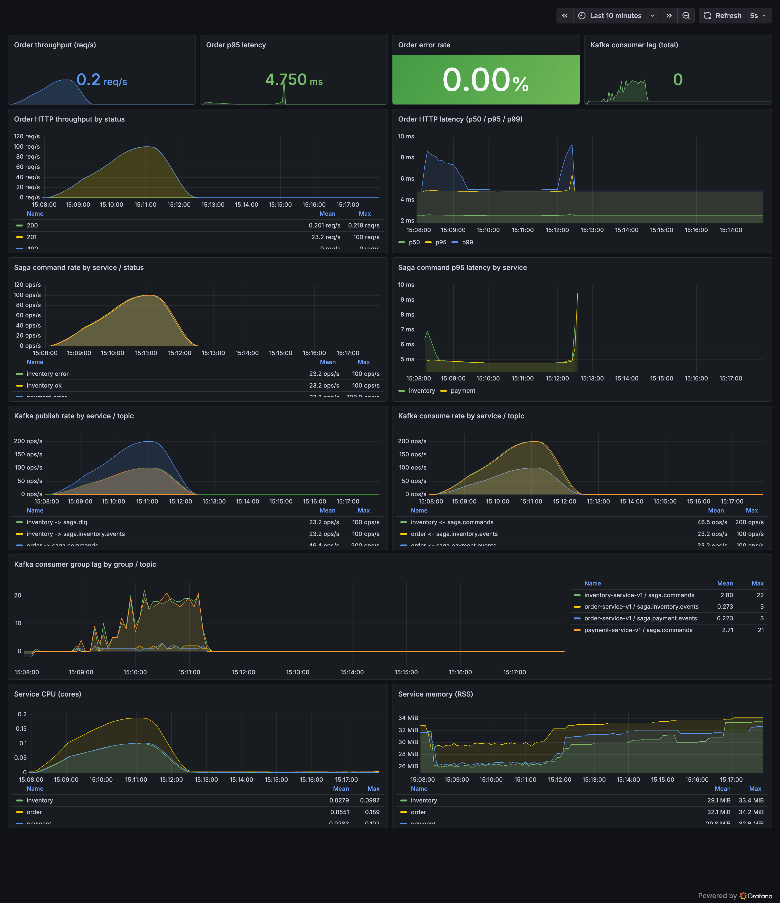
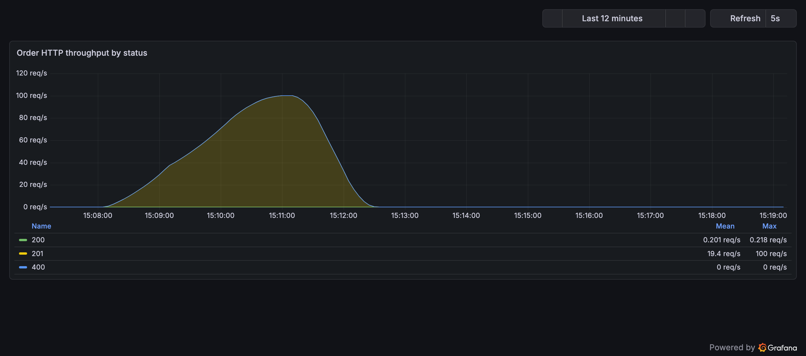
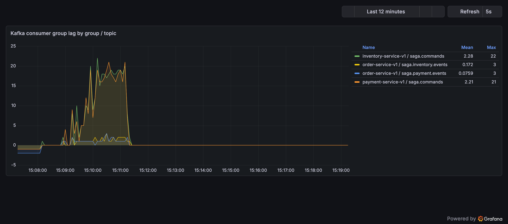

# Observability и нагрузочное тестирование

Документ показывает стек мониторинга и нагрузочный прогон саги (order → inventory → payment),
снятый end-to-end на одной машине разработчика.

## Стек

| Компонент | Роль |
|---|---|
| **Prometheus** | Собирает метрики приложений и инфраструктуры каждые 5 с (`monitoring/prometheus.yml`) |
| **Grafana** | Дашборды как код (`monitoring/grafana/`) — datasource + `Saga Overview` |
| **kafka-exporter** | Лаг консьюмер-групп и офсеты топиков |
| **cAdvisor** | Метрики контейнеров (см. оговорку ниже) |
| **k6** | Генератор HTTP-нагрузки на сервис `order` (`loadtest/k6/`) |

Метрики приложений, которые отдаёт каждый сервис (`/metrics`):

- `order_http_requests_total{method,path,status}` / `order_http_request_duration_seconds`
- `<service>_command_total{type,status}` / `<service>_command_duration_seconds` (inventory, payment)
- `<service>_kafka_publish_total{topic,status}` / `_kafka_consume_total{topic,status}` (+ длительности)
- стандартные коллекторы `process_*` / `go_*` (на них построены панели CPU / RSS по сервисам)

Дашборд лежит в репозитории и автоматически подгружается на `make up` — без ручного накликивания и
без дашбордов, запертых в Docker-томе.

## Нагрузочный тест

Профиль: **`orders-arrival.js`** (k6 `ramping-arrival-rate`) — рампа по частоте запросов
`50 → 100 → 100 → 0` RPS за ~3.5 мин. Перед прогоном склад и баланс счёта засеиваются через
`make load-prefill`.

```bash
make up                 # инфраструктура + мониторинг + сервисы
make load-prefill       # засеять сток sku-1 и баланс acc-1
make load-arrival       # рампа arrival-rate ~3.5 мин
```

### Результаты

| Метрика | Значение |
|---|---|
| Создано заказов (HTTP 201) | **14 099** |
| Ошибок запросов | **0 (0.00 %)** |
| Пропускная способность (средняя) | ~67 req/s (пик arrival 100 RPS) |
| Latency avg / p95 / p99 | 1.68 мс / 3.65 мс / 5.78 мс |
| Latency max | 17.49 мс |
| Финальное состояние саги | каждый заказ дошёл до `completed` |

Под нагрузкой лаг консьюмер-группы Kafka вырос до пика ~22 сообщений и **вернулся к 0** после
завершения рампы — то есть консьюмеры успевали, и никакого бэклога не осталось.

## Дашборды

### Saga Overview (общий вид)



Верхний ряд (одиночные стат-панели): пропускная способность заказов, p95 latency, доля HTTP-ошибок,
суммарный лаг консьюмеров Kafka. Далее: HTTP-throughput по статусам и перцентили latency, частота и
latency saga-команд по сервисам, частота publish/consume Kafka по топикам, лаг консьюмер-групп и
CPU / память по каждому сервису.

### HTTP-throughput заказов по статусам



### Лаг консьюмер-группы Kafka (растёт под нагрузкой, сливается в 0)



---

## Методология и честные оговорки

Эти цифры демонстрируют **observability и поведение саги под нагрузкой**, а не абсолютную
пропускную способность системы. Читать их нужно с учётом следующего:

- **Запуск на одной машине.** Генератор нагрузки k6 работает на *том же хосте* (Apple Silicon), что
  и все три сервиса, три инстанса Postgres, Kafka, Prometheus и Grafana. Генератор нагрузки и
  тестируемая система (SUT) конкурируют за одни и те же CPU/RAM, а весь трафик идёт через loopback
  (без сетевого RTT) — поэтому latency в диапазоне «доли миллисекунды — единицы миллисекунд»
  оптимистичен, а достижимый RPS ограничен ноутбуком, а не кодом. Для достоверных цифр
  производительности генератор нагрузки должен работать на отдельном железе от SUT.
- **cAdvisor на Docker Desktop (macOS)** отдаёт только cgroup-`id`, без имён/лейблов контейнеров,
  поэтому панели ресурсов по сервисам используют собственные метрики сервисов `process_*`.

## Проблемы, вскрытые этим прогоном (хорошие кандидаты на доработку)

1. **Общий топик `saga.commands` раздувает ошибки команд.** `inventory` и `payment` читают один и
   тот же топик команд; команда, адресованная другому сервису, не проходит проверку
   `Qty<=0 || SKU==""` и учитывается как `command_total{status="error"}` ещё до `switch` по типу. На
   дашборде это выглядит как ~50 % «ошибочных» команд, которые на деле не являются сбоями саги.
   Фикс: маршрутизировать команды по сервисам (отдельный топик на сервис или фильтр по типу/заголовку),
   либо коротко замыкать чужие типы команд на ветку `default:` (no-op) до проверки-валидации.
2. **Чек k6 `response has order id` падает в 100 % случаев.** Ответ заказа сериализует имена полей
   Go (`"ID"`, с большой буквы), потому что у структуры ответа нет `json`-тегов; а чек k6 ищет
   `id` в нижнем регистре. Заказы реально создаются (HTTP 201, сага `completed`) — просто ключ в
   чеке в неправильном регистре. Фикс: добавить теги `json:"id"` к DTO ответа заказа (и/или
   поправить чек в k6).